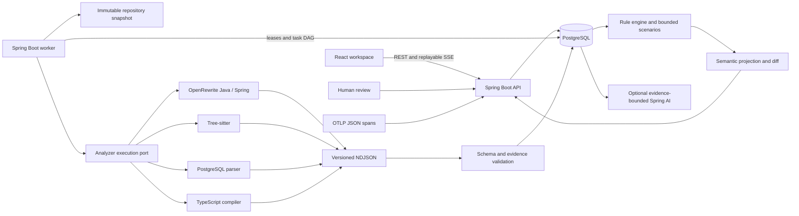

# System Architecture

## Ownership

Spring Modulith verifies Java feature dependencies. The platform jar supports
API and worker deployment profiles; analyzer jars are never hot-loaded into it.
The protocol module has no platform persistence dependency.

The organization and project are part of every persistent analysis lookup.
Project access also requires membership unless the trusted identity is an
organization administrator. Worker queue scans are privileged internal actions,
not caller-facing global lookups.

Project CRUD uses JPA. The task queue and semantic graph use PostgreSQL/JDBC for
atomic claiming, composite foreign keys, JSONB extensions and bounded queries.
Physical deletion is not the project DELETE operation: archived projects become
inaccessible while audit records and immutable revision evidence remain.

## Trust Layers

1. Parser facts contain source locations, exact snippet hashes and execution provenance.
2. Ingestion validates schemas, paths, ranges and hashes. Invalid facts are quarantined.
3. Normalization and rule classification create explicit assertions with scoring.
4. Optional AI produces constrained wording associated with existing fact IDs.
5. Review decisions are append-only, with stale status when source fingerprints change.
6. Canvas layout is user-owned visual state, never canonical semantic data.

Runtime observations supplement static results. An absent trace does not prove
that a path cannot run. Exact node matches and unresolved spans remain distinct.

## Queue and Failure Model

Each run has a persisted task DAG. Workers claim eligible tasks with
`FOR UPDATE SKIP LOCKED`, renew leases, fence mutations by owner and lease token,
and recover abandoned tasks. Retries are bounded with backoff. Cancellation is
persisted and checked during process execution. Partial analyzer results and
quarantined facts cannot be represented as complete coverage.

## Storage and Retention

Canonical facts, nodes and evidence are scoped to immutable analysis runs.
Minimal source snippets are retained under organization policy. Workspace expiry
removes only verified descendants of the artifact root, marks source unavailable
and preserves historical hashes. Credentials are not part of snapshots.

`ArtifactStore` isolates local artifact reads/writes and retention from storage
key handling. The local implementation enforces bounded reads/writes, create-new
semantics, path confinement and link rejection. S3 is an extension point, not an
implemented deployment mode.

Technology detections are stored with their component, evidence and fingerprint.
This is one owned component record rather than an unbounded entity/attribute
table. `raw_fact` exposes generated contract/version, subject and properties
columns in addition to the original validated envelope.

## Local and Production Runtime

Compose is a development topology with a Docker-capable worker. The host path
mapping is explicit because sibling containers resolve mounts on the Docker
host, not within the worker filesystem. Docker Desktop accepts normalized
Windows host paths. Source, request and root filesystems are read-only inside
analyzer containers; output is the sole persistent writable mount.

OIDC, secret references, repository host allowlists and immutable image digests
are production configuration. An external provider or cluster is not considered
verified solely because its adapter compiles.
